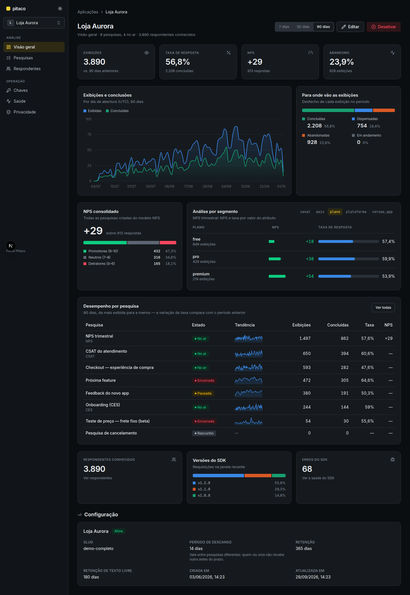

# Pitaco — inventário de funcionalidades

O que o Pitaco faz hoje, de ponta a ponta: o backend (API administrativa e superfície de coleta),
o painel e o SDK React Native. Cada item aponta onde mora no código e em que tela do painel
aparece. Para ver tudo funcionando com dados, carregue a demo com [`seed/carregar-demo.sh`](../seed/README.md).

Legenda das telas: caminhos relativos a `/aplicacoes/{aplicação}`.

---

## 1. Aplicações

A aplicação é a raiz de tudo: chaves, pesquisas, respondentes e políticas de privacidade.

| Funcionalidade | Detalhe | Backend | Painel |
| --- | --- | --- | --- |
| Cadastro | Nome e slug únicos; slug gerado do nome quando omitido | `POST /applications` | `/aplicacoes/nova` |
| Listagem com filtro | Por situação (ativa/inativa), paginada, filtro na URL | `GET /applications` | `/aplicacoes` |
| Edição | Nome, intervalo de descanso, retenção de respostas e de texto livre (campo vazio remove o prazo) | `PATCH /applications/{id}` | Visão geral → Editar |
| Ativar / desativar | Aplicação inativa não entrega pesquisa e descarta coleta | `POST /applications/{id}/activate`, `/deactivate` | Visão geral → Desativar |
| Intervalo de descanso | Quem viu uma pesquisa não recebe outra da mesma aplicação antes do prazo | `quietPeriodDays` | Visão geral → Configuração |
| Troca rápida de aplicação | Seletor no topo da sidebar | — | Sidebar |

## 2. Chaves de acesso (SDK)

| Funcionalidade | Detalhe | Backend | Painel |
| --- | --- | --- | --- |
| Emissão | Rótulo livre; o segredo aparece **uma única vez** | `POST …/api-keys` | `/chaves` |
| Listagem e detalhe | Prefixo, situação, criação, último uso | `GET …/api-keys` | `/chaves` |
| Revogação | Chave revogada responde 401 na coleta | `DELETE …/api-keys/{id}` | `/chaves` |
| Superfície separada | Chave de app é recusada nas rotas administrativas (`api_key.forbidden_surface`) | `AdminSurfaceInterceptor` | — |
| Limite de requisições | 1.200/min por chave, 120/min por origem, 30/min para erros de SDK; `429` com `Retry-After` | `infra/http/ratelimit` | — |

## 3. Pesquisas — montagem

| Funcionalidade | Detalhe | Backend | Painel |
| --- | --- | --- | --- |
| Criar em branco ou por modelo | Modelos NPS (0–10), CSAT (1–5) e CES 2.0 (1–7) com a pergunta oficial do formato | `POST …/surveys` (`template`) | `/pesquisas/nova` |
| Seis tipos de pergunta | Escolha única, múltipla, avaliação, escala, NPS, texto livre | `POST …/questions` | Montagem |
| Opções e faixas | Opções com rótulo/valor; faixa com rótulos dos extremos | `AddQuestionRequestDTO` | Montagem |
| Pergunta condicional | Aparece só se a resposta a uma anterior satisfaz `equals`, `not_equals`, `in` ou `between` | `ConditionDTO` | Montagem → Condição |
| Reordenar | Arrastar e soltar (dnd-kit) ou setas | `PUT …/questions/order` | Montagem |
| Pré-visualização ao vivo | O renderizador real do SDK (react-native-web) dentro do painel | `@pitaco/react-native/preview` | Montagem |
| Renomear, duplicar, descartar | Duplicar pode ir para outra aplicação; descartar só rascunho nunca publicado | `PATCH`, `POST …/duplicate`, `DELETE` | Cabeçalho da pesquisa |
| Aviso de texto livre | Lembrete de não escrever dado pessoal, ligável e com texto próprio | `freeTextNoticeEnabled/Text` | Disparo |

## 4. Pesquisas — disparo e exposição

| Funcionalidade | Detalhe | Backend | Painel |
| --- | --- | --- | --- |
| Evento de disparo | Nome de evento do app (`checkout.completed`), igualdade exata | `PUT …/trigger` | `/disparo` |
| Janela | Início e fim opcionais (sem fim = indeterminada) | `windowStart`, `windowEnd` | Disparo |
| Amostragem | Fração do público elegível que vê a pesquisa (0–100%) | `samplingRate` | Disparo |
| Segmentação | Regras por atributo: `equals`, `not_equals`, `present`, `absent` | `POST …/trigger/rules` | Disparo → Regras |
| Prioridade | Desempate entre pesquisas que disputam o mesmo evento (−100 a 100) | `priority` | Disparo → Exposição |
| Cota de respostas | Encerra sozinha ao atingir N concluídas; progresso visível | `responseQuota`, `GET …/quota-progress` | Disparo |
| Ignorar descanso | A pesquisa pode furar o intervalo de descanso da aplicação | `ignoresQuietPeriod` | Disparo |
| Catálogo observado | Eventos e atributos que o app já enviou, para autocompletar | `GET …/events`, `…/attributes` | Disparo |

## 5. Publicação, versões e ciclo de vida

| Funcionalidade | Detalhe | Backend | Painel |
| --- | --- | --- | --- |
| Impedimentos | O que impede publicar (sem pergunta, sem disparo, …) | `GET …/publication-impediments` | `/publicacao` |
| Avisos | Pesquisas concorrentes no mesmo evento, alcance da segmentação, SDKs que não suportam algum tipo | `GET …/publication-warnings` | Publicação |
| Versões | Publicar congela a versão; mudar abre rascunho de versão nova | `POST …/versions`, `DELETE …/versions/draft` | `/versoes` |
| Classificação da mudança | `cosmetic` (verificada contra a anterior) ou `semantic`, com resumo | `PublishSurveyRequestDTO` | Publicação |
| Comparabilidade | Agrupa versões que podem ser somadas com segurança | `GET …/versions/comparability` | Versões, Resultados |
| Estados | Rascunho → Agendada → No ar ⇄ Pausada → Encerrada (manual ou por cota) | `POST …/pause`, `/resume`, `/end` | Cabeçalho da pesquisa |
| Histórico de transições | Quem, quando e por quê | `GET …/transitions` | Cabeçalho da pesquisa |

## 6. Coleta (superfície do SDK)

Seis rotas públicas sob `/collect`, autenticadas por `X-Pitaco-Key`. Contrato completo em
[`backend/docs/backend/contrato-sdk.md`](../backend/docs/backend/contrato-sdk.md).

| Funcionalidade | Detalhe |
| --- | --- |
| Elegibilidade | "Há pesquisa para este respondente agora?" — aplica janela, segmentação, amostragem, descanso, já-respondida e limite de abandonos; registra evento, atributos e versão do SDK |
| Abertura de exibição | `displayId` gerado no dispositivo, idempotente; congela a versão |
| Envio | Respostas + desfecho (`COMPLETED`/`DISMISSED`) num ato atômico, validado inteiro |
| Abandono derivado | Exibição sem desfecho em 30 minutos vira abandonada na leitura; 3 abandonos param a entrega |
| Eventos de interação | Catálogo fechado de 18 eventos (visualização, seleção, troca, foco, validação, navegação, saída com tempo ativo, segundo plano, dispensa com via, conclusão) |
| Supressões | O SDK avisa quando não sabe renderizar a pesquisa (tipo ou recurso desconhecido) |
| Erros do SDK | Canal próprio, com mascaramento de dado pessoal no servidor |
| Identidade | `reference` do app (prevalece) e/ou `deviceId`; nunca dado pessoal |

## 7. Análise (painel)

| Funcionalidade | Detalhe | Tela |
| --- | --- | --- |
| **Visão geral da aplicação** | KPIs de exibições, taxa de resposta, NPS e abandono com variação contra o período anterior; período 7/30/90 dias na URL | `/` (Visão geral) |
| Tendência diária | Exibições e conclusões por dia, com a taxa do dia no tooltip | Visão geral, Resultados |
| Desfechos | Concluídas, dispensadas, abandonadas, em andamento (barra 100%) | Visão geral, Resultados |
| NPS consolidado | Soma dos grupos de todas as pesquisas do modelo NPS | Visão geral |
| **Análise por segmento** | NPS (barra divergente) e taxa de resposta por valor de qualquer atributo (plano, plataforma, país…) | Visão geral |
| Desempenho por pesquisa | Tabela com estado, sparkline, exibições, concluídas, taxa (com variação) e NPS | Visão geral |
| Resultados por pergunta | Barras por opção (cor fixa por opção), histograma de notas, NPS por faixa, média; contagem e proporção sempre juntas | `/pesquisas/{id}/resultados` |
| Recorte | Período (atalho ou personalizado), atributo (com valor ou ausente) e versão — na URL, compartilhável | Resultados, Comportamento |
| Respostas abertas | Busca, paginação e contexto da mesma exibição | Resultados |
| Export CSV | Com confirmação sobre dado pessoal; respeita o recorte | Resultados |
| Avisos de leitura | Amostra pequena, versões incomparáveis, pesquisa suprimida, retenção aplicada | Resultados |
| **Comportamento** | Funil por pergunta (respondida/pulada/parou aqui), tempo ativo (mediana e p90), vias de dispensa, sinais de atrito (volta, troca de resposta, bloqueio de validação) e as definições de cada métrica | `/pesquisas/{id}/comportamento` |
| Exibições | Lista filtrável por desfecho e período; detalhe com respostas e atributos | `/pesquisas/{id}/exibicoes`, `/exibicoes/{id}` |
| Respondentes | Lista e histórico de exibições de cada respondente | `/respondentes` |

## 8. Saúde do SDK

| Funcionalidade | Detalhe | Tela |
| --- | --- | --- |
| Versões em uso | Tráfego recente e total por versão; "sumiu do tráfego" após 14 dias | `/saude`, Visão geral |
| Erros do SDK | Lista filtrável por tipo e versão, com contexto | `/saude` |
| Supressões por pesquisa | Proporção de supressões e a versão mínima que renderizaria | Resultados |
| Evento nunca visto | Avisa quando o evento de disparo nunca chegou | Resultados |

## 9. Privacidade

| Funcionalidade | Detalhe | Backend | Painel |
| --- | --- | --- | --- |
| Política de retenção | Prazo para respostas e outro para texto livre; prévia do que seria descartado | `GET …/retention-preview` | `/privacidade` |
| Descarte automático | Job diário; congela o agregado antes de apagar, para os resultados continuarem somando | `RetentionJob` | Resultados (nota de retenção) |
| Exclusão do titular | Apaga um respondente por referência ou dispositivo, com auditoria | `DELETE …/respondents` | `/privacidade` |
| Auditoria | Registro de cada exclusão | `GET …/deletion-audits` | `/privacidade` |

## 10. SDK React Native (`@pitaco/react-native`)

| Funcionalidade | Detalhe |
| --- | --- |
| `PitacoProvider` + `usePitaco().track(evento)` | Integração em poucas linhas; falha do Pitaco é silêncio no app |
| Apresentações | Bottom sheet, modal de tela cheia, inline (`PitacoBlock`) e headless (`usePitacoSurvey`) |
| Tema e textos | Tokens com validação de contraste, textos traduzíveis, slots de cabeçalho/rodapé/agradecimento |
| Renderizadores próprios | Troque o componente de um tipo de pergunta, com fronteira de erro |
| Fila offline | Abertura, envio e eventos em fila persistente, com reenvio ordenado e idempotente |
| Armazenamento | AsyncStorage ou MMKV |
| Eventos para o app | `onEvent` com o catálogo de interação e os eventos de posicionamento (`placement_*`) |
| Preview web | O mesmo renderizador dentro do painel |

## 11. Operação

| Funcionalidade | Onde |
| --- | --- |
| OpenAPI / Swagger UI | `/api/swagger-ui.html` (especificação em `/api/v3/api-docs`) |
| Observabilidade (traces, logs, métricas OTLP → Grafana LGTM) | `compose.yaml`, `OpenTelemetryLogbackConfig` |
| Backup e teste de restauração | `ops/backup`, `ops/RUNBOOK.md` |
| CI por projeto | `.github/workflows/{backend,painel,sdk,compose}.yml` |
| Demo completa | [`seed/carregar-demo.sh`](../seed/README.md) |
