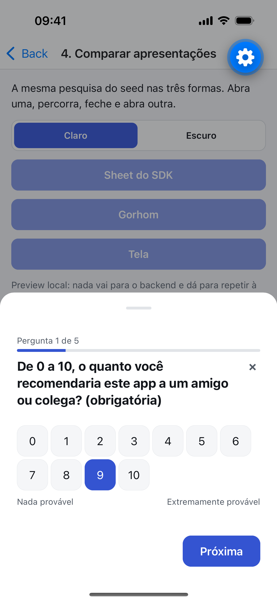
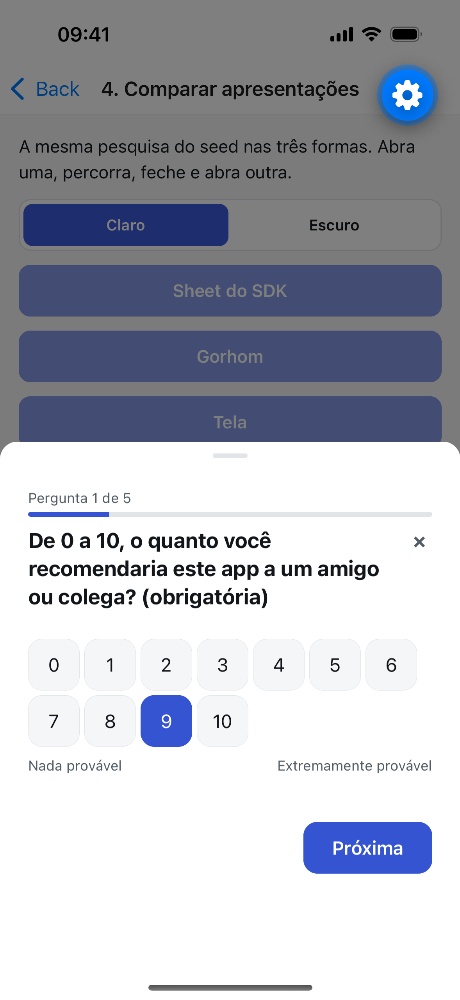
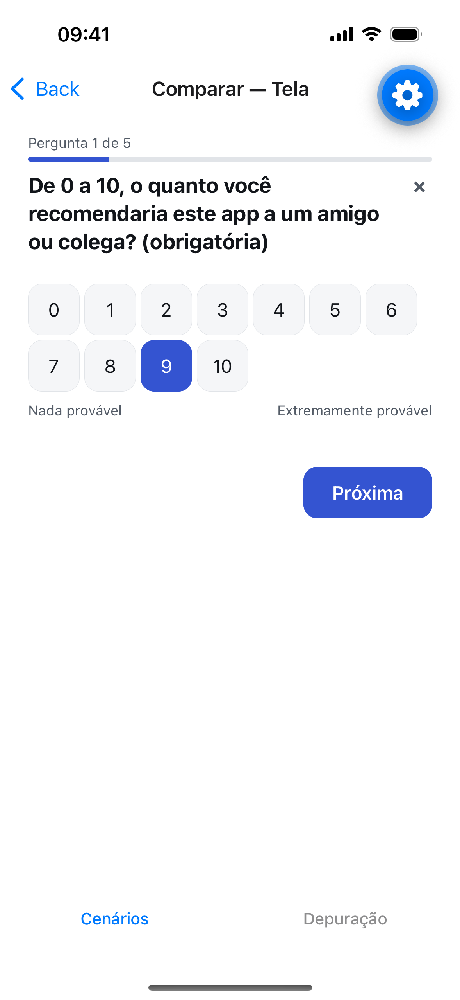
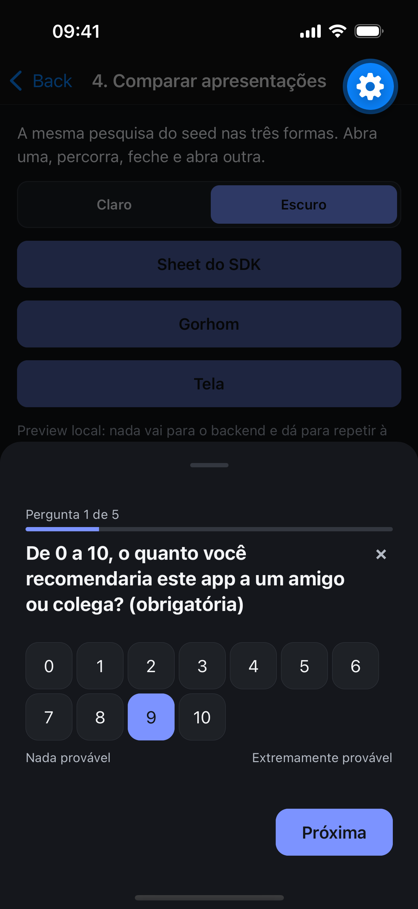
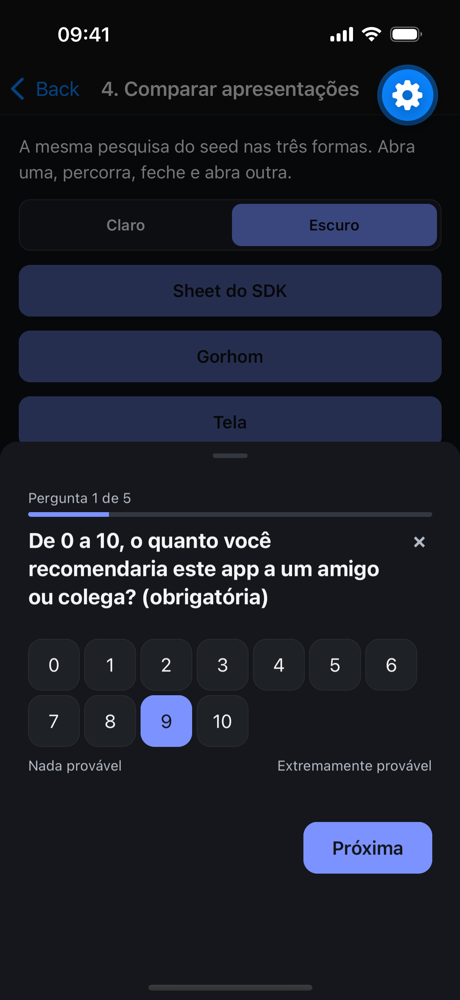
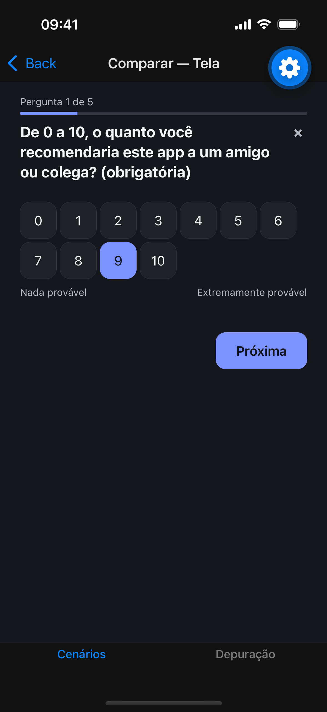
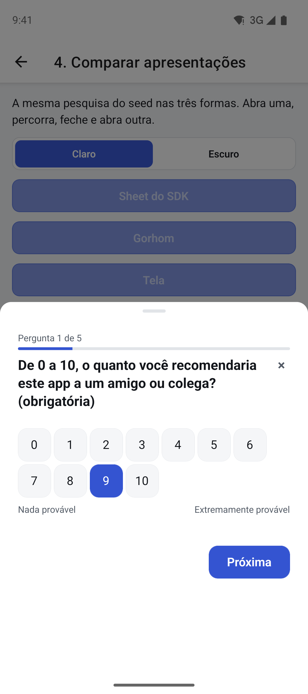
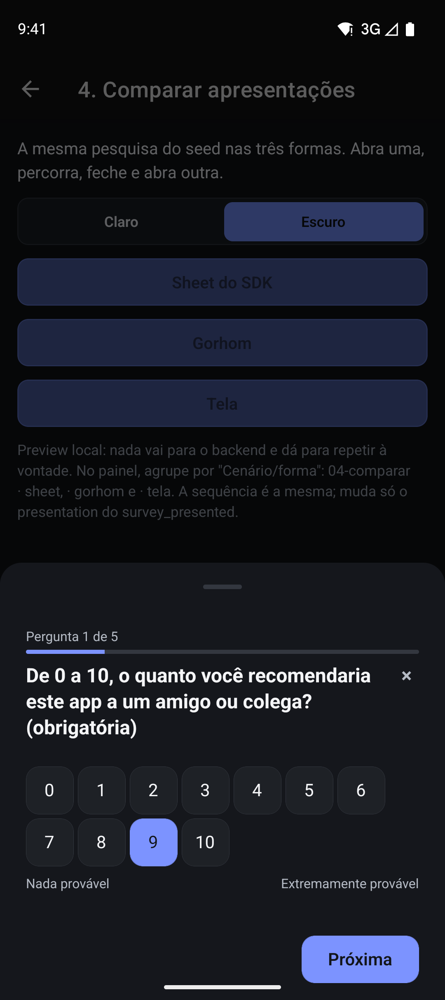
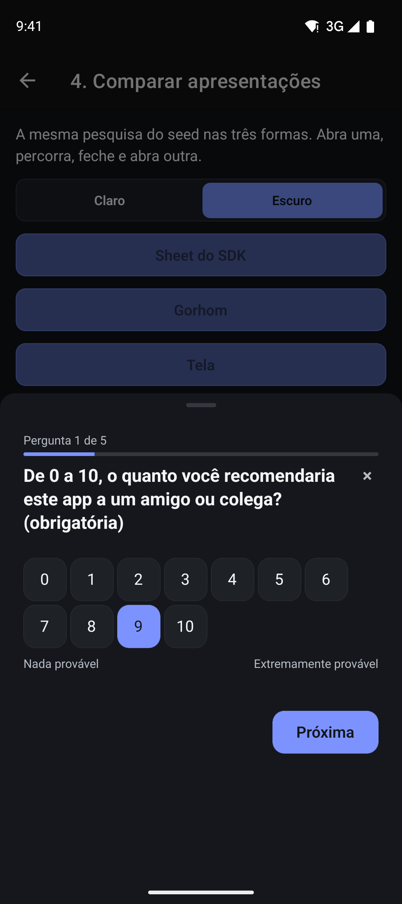
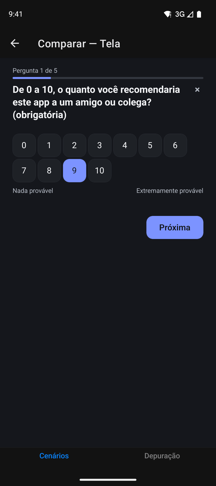

# Exemplo do Pitaco para React Native

App Expo que roda o SDK `@pitaco/react-native` no Expo Go, em iOS e Android, contra um Pitaco na
sua máquina. Não é demonstração descartável: é o **harness de integração** do SDK. Cada um dos
quinze cenários é uma tela que exercita uma forma de integrar, e o painel de depuração mostra ao
vivo o que o SDK faz (eventos, fila, requisições e identidade).

O que ele prova:

- **O SDK roda sem módulo nativo.** O app abre no Expo Go, sem build nativo. O SDK só tem `react`
  e `react-native` como dependências de par; o bottom sheet dele usa só `Modal`, `Animated` e
  `PanResponder`.
- **O SDK convive com as bibliotecas que o app já usa, sem exigi-las.** `react-native-reanimated`,
  `react-native-gesture-handler`, `@gorhom/bottom-sheet`, `react-native-safe-area-context` e
  `@react-native-async-storage/async-storage` são dependências **do exemplo**, nunca do SDK.
- **O código-fonte do SDK é o que roda.** O Metro resolve `@pitaco/react-native` para `../src`
  (com os subcaminhos `/preview` e `/storage/*`) e usa uma única cópia de `react` e `react-native`.
  Editar o SDK recarrega o exemplo na hora.

## Pré-requisitos

- **Node 22.18 ou mais novo** (os scripts `.ts` do exemplo rodam direto no Node).
- **Docker** (o perfil local do backend sobe o Postgres pelo Docker Compose) e **Java 21** para o
  backend.
- **Simulador iOS** (Xcode) ou **emulador Android** (Android Studio). O Expo Go do SDK 57 é
  instalado sozinho na primeira abertura.
- Opcional: **Maestro**, para os fluxos de ponta a ponta (`maestro --version`).

## Do zero à primeira pesquisa

Tudo abaixo, salvo o backend, roda dentro de `sdk/example/`.

1. **Suba o backend** na porta 8080, num terminal à parte:

   ```bash
   cd backend && ./mvnw spring-boot:run -Dspring-boot.run.profiles=local
   ```

2. **Instale o exemplo:**

   ```bash
   cd sdk/example && npm install
   ```

3. **Semeie o backend** para o alvo em que o app vai rodar:

   ```bash
   npm run seed                          # simulador iOS
   npm run seed -- --target android-emu  # emulador Android
   ```

   O seed cria a aplicação de exemplo, a chave, a pesquisa e o disparo, e escreve o `.env`. Veja
   [Conexão com o backend](#conexão-com-o-backend).

4. **Suba o Metro e abra no Expo Go:**

   ```bash
   npx expo start          # depois, "i" para o iOS ou "a" para o Android
   ```

   Ou `npm run ios` / `npm run android`. Na primeira abertura o Expo Go mostra a apresentação do
   menu de desenvolvedor: toque em **Continue** e feche o menu.

5. **Veja a pesquisa:** na tela inicial, toque em **1. Sheet do SDK** e depois em **Disparar
   pesquisa**. A pesquisa abre no bottom sheet do SDK. Na aba **Depuração**, os eventos
   `survey_presented`, `question_viewed` e os seguintes aparecem conforme você responde.

É a integração mínima, a mesma que o guia do SDK ensina:

```tsx
import AsyncStorage from '@react-native-async-storage/async-storage';
import { PitacoProvider, usePitaco } from '@pitaco/react-native';
import { createAsyncStorageAdapter } from '@pitaco/react-native/storage/async-storage';

const storage = createAsyncStorageAdapter(AsyncStorage);

export function App() {
  return (
    <PitacoProvider baseUrl="http://localhost:8080/api" apiKey="pit_..." storage={storage}>
      <Checkout />
    </PitacoProvider>
  );
}

function Checkout() {
  const { track } = usePitaco();
  return <Button title="Concluir compra" onPress={() => void track('pitaco.example.trigger')} />;
}
```

Se a pesquisa não abrir, veja [Diagnosticar pelo painel](#diagnosticar-pelo-painel).

## Conexão com o backend

O exemplo fala com um Pitaco rodando na sua máquina. Você precisa do backend de pé na porta 8080
(`cd backend && ./mvnw spring-boot:run -Dspring-boot.run.profiles=local`, que sobe o Postgres pelo
Docker) e do Node 22.18 ou mais novo.

### 1. Semear o backend

Dentro de `sdk/example/`:

```bash
npm run seed                                            # simulador iOS (padrão)
npm run seed -- --target android-emu                    # emulador Android
npm run seed -- --target device --lan-ip 192.168.0.10   # aparelho físico na mesma rede
```

O seed usa a API administrativa local para criar a aplicação "Pitaco Example App", emitir uma
chave, criar a "Pesquisa de exemplo" com os seis tipos de pergunta (NPS, escala, nota, escolha
única, múltipla escolha e texto livre), rótulos nas escalas, uma condição (o motivo só aparece para
nota de 0 a 6), aviso de texto livre, disparo no evento `pitaco.example.trigger` e publicar. Ele
escreve o `.env` (preservando as outras linhas) e `src/generated/seed-survey.json`, o schema que o
cenário 4 usa no `<PitacoPreview />`. Rodar de novo não duplica nada: reaproveita a aplicação, a
pesquisa e a chave.

A pesquisa fica o mais reexibível possível: amostragem de 100%, sem descanso, sem cota, janela
aberta. O servidor ainda não mostra de novo uma pesquisa já respondida ou dispensada pelo mesmo
respondente, e para depois de 3 abandonos. Para vê-la de novo no mesmo aparelho, use **Limpar
storage e identidade** no painel de depuração.

### 2. O `.env`

Veja `.env.example`. As três variáveis:

| Variável | Para quê |
| --- | --- |
| `EXPO_PUBLIC_PITACO_BASE_URL` | Perfil direto: o endereço do Pitaco com o prefixo `/api`. |
| `EXPO_PUBLIC_PITACO_PROXY_BASE_URL` | Perfil com gateway (cenário 15): o proxy local, prefixo `/pitaco`. |
| `EXPO_PUBLIC_PITACO_API_KEY` | A chave da aplicação de exemplo, a mesma nos dois perfis. |

O host depende de onde o app roda:

| Alvo | Direto | Pelo proxy |
| --- | --- | --- |
| Simulador iOS | `http://localhost:8080/api` | `http://localhost:8787/pitaco` |
| Emulador Android | `http://10.0.2.2:8080/api` | `http://10.0.2.2:8787/pitaco` |
| Aparelho físico | `http://<IP-do-computador>:8080/api` | `http://<IP-do-computador>:8787/pitaco` |

No emulador Android, `10.0.2.2` é o seu computador visto de dentro do emulador (`localhost` lá
dentro é o próprio emulador). No aparelho físico, o celular e o computador precisam estar na mesma
rede, e o firewall do computador precisa liberar as portas 8080 e 8787.

O `.env` vale para um alvo por vez: para trocar do iOS para o Android (ou o contrário), rode o seed
com o outro `--target` e reinicie o `npx expo start` com `-c`, porque o Expo embute as variáveis
`EXPO_PUBLIC_` no bundle.

### 3. O proxy (topologia com gateway)

```bash
npm run proxy   # http://0.0.0.0:8787/pitaco -> http://localhost:8080/api
```

É um proxy transparente em Node, sem dependência, que segue `backend/docs/backend/proxy.md`:
repassa só `POST /pitaco/collect/*` para `/api/collect/*`, sem mexer em corpo, chave ou
`X-Pitaco-Sdk-Version`; substitui o `X-Forwarded-For` pelo IP que viu; devolve status, corpo e
cabeçalhos do Pitaco intactos (inclusive `Retry-After`). Qualquer outra rota recebe 404. O SDK não
sabe que está falando com um proxy: só o `baseUrl` muda. Opções: `--port`, `--target`, `--prefix`.

No app, o seletor **Direto | Proxy** da tela inicial troca o perfil do app inteiro, e o cenário 15
força o perfil Proxy só na tela dele.

### 4. Conferir sem abrir o app

```bash
npm run smoke   # com o backend e o proxy de pé
```

Faz, direto e pelo proxy, o que o SDK faz: elegibilidade com o disparo do seed, abertura da
exibição, um lote de eventos e uma resposta, e confere os status (200, 201, 202, 204). Usa
identidades descartáveis, então não gasta a pesquisa do seu simulador. Termina com "Tudo certo.".

## Os quinze cenários

Todos estão na tela inicial, um por tela. Os cenários 1, 2 e 3 usam o fluxo real (exibição e
resposta gravadas no backend). O cenário 4 reabre a pesquisa do seed localmente com o
`<PitacoPreview />`, sem backend. Os cenários 5 a 10 têm os dois modos: **Fluxo real** e **Preview
local**, para repetir sem limpar a identidade a cada volta.

| # | Cenário | O que demonstra |
| --- | --- | --- |
| 1 | Sheet do SDK | A integração mínima: o Provider e um botão que chama `track`, com o bottom sheet próprio do SDK. Arrastar para fechar, tocar no fundo, voltar do Android, teclado subindo no texto livre e animação curta com movimento reduzido. |
| 2 | Com gorhom | A pesquisa num `BottomSheetModal` do `@gorhom/bottom-sheet` do app, com `<PitacoSurveyContent />` dentro. Arrastar vira `via: "swipe"`, o fundo `backdrop`, o voltar do Android `hardware_back`; no texto livre o sheet sobe e o campo fica acima do teclado. |
| 3 | Como tela | A pesquisa como rota do Expo Router, com cabeçalho nativo. Concluir volta sozinho; sair pela seta, pelo gesto do iOS ou pelo voltar do Android vira `survey_dismissed` com `via: "navigation"`. |
| 4 | Comparar apresentações | A mesma pesquisa do seed nas três formas (Sheet do SDK, Gorhom e Tela), em tema claro ou escuro. No painel, agrupe por "Cenário/forma" para ver que a sequência de eventos é a mesma. |
| 5 | Tema | Claro, escuro e um tema com valores inválidos que degrada token a token para o padrão. |
| 6 | Textos | Rótulos do SDK em inglês (`strings`). |
| 7 | Renderizador substituído | Um NPS desenhado pelo app convivendo com os tipos padrão, e um renderizador que lança erro de propósito: cai nas estrelas padrão e o SDK manda `POST /collect/sdk-errors`. |
| 8 | Slots | Cabeçalho e rodapé próprios. |
| 9 | Headless | UI inteiramente própria sobre `usePitacoSurvey()`: validação, voltar, pular, texto livre e concluir, com o mesmo tracking da UI padrão. |
| 10 | Modal e inline | O modal em tela cheia do SDK, e `<PitacoSurveyContent />` no meio de uma tela com rolagem, sem contêiner. |
| 11 | Bloqueio | Uma tela de pagamento com `<PitacoBlock />`: o evento dispara, nada aparece (`placement_blocked`, `placement_survey_held`), e a pesquisa abre ao sair. |
| 12 | Adiamento | `defer()` numa tela e `release()` em outra (`placement_released`), e um adiamento que estoura o prazo (`placement_expired`). |
| 13 | Sem rede | Responder sem rede, fechar o app, reabrir com rede e ver a resposta chegar uma vez só (conferido no backend). |
| 14 | Falhas | Chave inválida, endereço inalcançável e API lenta, com o app seguindo navegável e nenhuma pesquisa. |
| 15 | Proxy | O fluxo do cenário 1 pela topologia com gateway (perfil Proxy). |

## O painel de depuração

A aba **Depuração** mostra, ao vivo, o que o SDK está fazendo. Nada disso é API do SDK: o painel
lê o `onEvent` do Provider, o `usePitaco().diagnostics()` e um embrulho do `fetch` global que o
exemplo instala (só para URLs do Pitaco, com a chave truncada).

- **Eventos:** cada evento do catálogo com o payload completo (toque para expandir). Agrupe por
  **Ordem**, por **Exibição** (`displayId`) ou por **Cenário/forma**. A linha já mostra a via da
  dispensa (`survey_dismissed · via swipe`).
- **Rede:** cada requisição ao Pitaco, com método, URL, cabeçalhos, corpo, status, duração e
  resposta.
- **Fila e identidade:** o `deviceId`, o estado da sessão, os portões de exibição e o conteúdo da
  fila local.

E quatro ações:

- **Limpar storage e identidade:** simula uma instalação nova. Apaga a fila e o `deviceId` do
  Pitaco e recria o runtime com um `deviceId` novo, sem reiniciar o app. É o que você usa para
  **rever a pesquisa**, já que o servidor não mostra de novo uma pesquisa respondida ou dispensada
  ao mesmo respondente.
- **Simular app reaberto:** zera o limite de uma pesquisa por sessão, como se o app tivesse sido
  fechado e aberto (`usePitaco().simulateAppReopen()`).
- **Copiar log** e **Limpar log.**

### Diagnosticar pelo painel

Quando a pesquisa não aparece, siga nesta ordem:

1. **Rede → `POST …/collect/eligibility`.** Sem nenhuma requisição, o `track` não foi chamado ou o
   Provider está desligado (sem `baseUrl` ou `apiKey`: rode o seed).
2. **Falha de rede ou timeout:** o endereço está errado para o alvo (`localhost` no emulador
   Android, por exemplo). Confira a tabela de endereços acima.
3. **401:** a chave está errada ou foi revogada. Rode o seed de novo.
4. **200 com `survey: null`:** o servidor decidiu não mostrar. Na maioria das vezes, o mesmo
   respondente já respondeu ou dispensou. Use **Limpar storage e identidade**.
5. **200 com a pesquisa, e nada na tela:** veja **Fila e identidade**. Se a sessão já mostrou uma
   pesquisa, use **Simular app reaberto**. No cenário 11, um `<PitacoBlock />` montado retém a
   pesquisa até sair da tela.

## Fluxos Maestro

Fluxos de ponta a ponta para os cenários 1, 2, 3, 7, 9, 11 e 13 ficam em `.maestro/`. Os mesmos
arquivos rodam no iOS e no Android; o que muda por plataforma fica em passos com
`when: platform`.

```bash
npm run e2e:ios       # simulador iOS, com o seed do iOS
npm run e2e:android   # emulador Android, com o seed do Android
```

Precisam do backend com o seed para a mesma plataforma e do Metro de pé (sem `CI=1`). Detalhes,
diferenças entre as plataformas e limitações em [`.maestro/README.md`](.maestro/README.md).

## Capturas

A mesma pergunta (a de NPS, com o 9 marcado) nas três formas do cenário 4, em claro e escuro.
Estão em `docs/capturas/`.

### iOS

| | Sheet do SDK | Gorhom | Tela |
| --- | --- | --- | --- |
| Claro |  |  |  |
| Escuro |  |  |  |

### Android

| | Sheet do SDK | Gorhom | Tela |
| --- | --- | --- | --- |
| Claro |  |  |  |
| Escuro |  |  |  |

### Vídeos

A pesquisa percorrida do começo ao fim em cada forma:

- iOS: [Sheet do SDK](docs/capturas/ios-sheet.mp4) · [Gorhom](docs/capturas/ios-gorhom.mp4) ·
  [Tela](docs/capturas/ios-tela.mp4)
- Android: [Sheet do SDK](docs/capturas/android-sheet.mp4) ·
  [Gorhom](docs/capturas/android-gorhom.mp4) · [Tela](docs/capturas/android-tela.mp4)

## Storage persistente: AsyncStorage aqui, MMKV no seu app

O exemplo usa o AsyncStorage, porque o `react-native-mmkv` não existe no Expo Go. O adaptador MMKV
do SDK é coberto pelos testes do SDK e se usa assim num app com build nativo (`react-native-mmkv`
4; nas versões 2 e 3, `new MMKV({ id: 'pitaco' })`):

```tsx
import { createMMKV } from 'react-native-mmkv';
import { createMmkvAdapter } from '@pitaco/react-native/storage/mmkv';

const storage = createMmkvAdapter(createMMKV({ id: 'pitaco' }));

<PitacoProvider baseUrl="…" apiKey="…" storage={storage}>…</PitacoProvider>;
```

Sem `storage`, o SDK funciona com a fila em memória e avisa em desenvolvimento: a resposta enviada
sem rede não sobrevive a um reinício do app.

## Limitações conhecidas

- **Gesto de voltar da borda do iOS:** não foi validado em simulador (nem o swipe do Maestro nem um
  arrasto com o mouse acionam o reconhecedor de borda). A seta do cabeçalho, que passa pelo mesmo
  desmonte da rota, foi validada. Confira o gesto num aparelho físico.
- **MMKV fora do Expo Go:** o `react-native-mmkv` fica só nas dependências de desenvolvimento, sem
  nenhum import em runtime. Ver a seção acima.
- **`CI=1` desliga a recarga do Metro:** nesse modo o Metro não observa os arquivos, e o app pode
  rodar código velho depois de uma edição. Suba o Metro sem `CI`.
- **Engrenagem do Expo Go:** o botão flutuante do Expo Go fica no canto superior direito e pode
  cobrir o X do modal em tela cheia (cenário 10). No Android, desligue em Expo Go → Settings →
  "Tools button". No iOS (Expo Go 57.0.9) não há essa opção: arraste-o para outro canto; o Expo Go
  guarda a posição. Só existe no Expo Go.
- **Um alvo por vez no `.env`:** o seed escreve o endereço de um alvo só (simulador iOS, emulador
  Android ou aparelho). Para trocar, rode o seed de novo e reinicie o Metro com `-c`.
- **O servidor decide a reexibição:** pesquisa respondida ou dispensada não volta para o mesmo
  respondente, e 3 abandonos param a entrega. O painel resolve com uma identidade nova.
